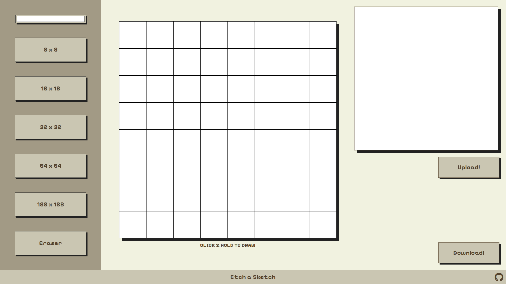

# 🎨 Etch-a-Sketch

A retro-inspired pixel drawing app built with HTML, CSS, and JavaScript.  
This interactive tool lets users draw pixel art by clicking and dragging, upload reference images, and download their creations as images — all within a clean, stylized interface.



---

## 🚀 Features

- 🎨 **Custom Pixel Grid**: Choose from 8×8 to 128×128 resolutions for different detail levels.
- 🖌️ **Color Picker**: Draw with any color using the integrated color input.
- 🧽 **Eraser Tool**: Switch to white to quickly erase parts of your drawing.
- 🖼️ **Reference Upload**: Upload a reference image to assist your sketching.
- 📥 **Download Artwork**: Save your final artwork as a `.png` image with one click.
- 🧠 **Click & Hold Drawing**: More intuitive interaction – drag to draw!

---

## 🛠️ Built With

- HTML5  
- CSS3 (with CSS Variables & Flexbox)  
- Vanilla JavaScript  
- [html2canvas](https://html2canvas.hertzen.com/) for DOM-to-image conversion  
- Google Fonts for styling (Pixelify, Tiny5, etc.)  
- Font Awesome for GitHub icon

---

## 📸 Interface Overview

```plaintext
+---------------------------+---------------------------+---------------------------+
|    Sketch Options (Left) |     Sketchboard (Middle)  |    Image & Download (Right)|
+---------------------------+---------------------------+---------------------------+
|  - Color Picker          |  - Draw Pixel Art         |  - Upload Reference Image |
|  - Grid Size Buttons     |  - "Click & Hold" To Draw |  - Download Button        |
|  - Eraser Button         |                           |                            |
+---------------------------+---------------------------+---------------------------+